# Technical Specification — Ferum Customizations

## Phase 1: Infrastructure and Base Environment Setup
- [ ] **Server Infrastructure**
  - [ ] Prepare a virtual or physical server with Ubuntu LTS.
  - [ ] Install Docker and Docker Compose.
  - [ ] Configure network environment and HTTPS access.

- [ ] **ERPNext Deployment**
  - [ ] Create `docker-compose.yml` with services: frappe/erpnext, postgres, redis, nginx.
  - [ ] Configure `.env` with secrets (passwords, keys).
  - [ ] Launch containers and verify correct operation.

- [ ] **ERPNext Site Creation**
  - [ ] Create site `erp.ferumrus.ru`.
  - [ ] Install `ferum_customs` app.
  - [ ] Configure company, currency, and taxes.

- [ ] **Git and CI/CD**
  - [ ] Initialize Git repository.
  - [ ] Set up pre-commit hooks (lint, mypy, pytest).
  - [ ] Configure GitHub Actions for tests, migrations, and deployment.

---

## Phase 2: ERPNext Module Development

- [ ] **Projects and Objects**
  - [ ] DocTypes: `ServiceProject`, `ServiceObject`, `ProjectObjectItem`.
  - [ ] Fields: contract details, client, SLA, deadlines, amount, status.
  - [ ] Logic: object uniqueness, prevent deletion of active objects, auto-generate requests from maintenance schedule.

- [ ] **Service Requests**
  - [ ] DocType: `ServiceRequest`.
  - [ ] Logic: strict workflow, SLA checks, escalation, auto-fill data, geo-tagging, offline photo cache.

- [ ] **Service Reports**
  - [ ] DocType: `ServiceReport` + children.
  - [ ] Logic: auto-sum from work items, link to request on submit, e-signature, work templates.

- [ ] **Finance**
  - [ ] DocType: `Invoice`.
  - [ ] Logic: statuses, Google Sheets sync, reports.

- [ ] **HR & Payroll**
  - [ ] DocType: `PayrollEntryCustom`.

- [ ] **Documents & Attachments**
  - [ ] DocType: `CustomAttachment`, Google Drive integration.

---

## Phase 3: Roles, Permissions, and Security

- [ ] **Roles**
  - [ ] Administrator, Director, Accountant, Department Head, Project Manager, Engineer, Office Manager, Client, Contractor (optional).

- [ ] **Permissions**
  - [ ] Permissions matrix from `Technical_Specification.txt`.

- [ ] **Security**
  - [ ] 2FA, HTTPS, backups, RTO/RPO tests.

---

## Phase 4: External Backend, API, and Integrations

- [ ] **FastAPI Backend**
  - [ ] Endpoints `/projects`, `/requests`, `/reports`, `/invoices`.
  - [ ] JWT + 2FA, role-based checks.

- [ ] **Google Integrations**
  - [ ] Drive: upload/delete files, store links in ERPNext.
  - [ ] Sheets: sync invoices automatically.

- [ ] **Bots**
  - [ ] Telegram (Aiogram), WhatsApp (optional).

---

## Phase 5: Monitoring, Analytics, and Testing

- [ ] **Monitoring**
  - [ ] Sentry, Prometheus, KPI dashboards.

- [ ] **Analytics**
  - [ ] ERPNext reports, API for bot analytics.

- [ ] **Testing**
  - [ ] Unit, E2E, load testing.

- [ ] **Staging**
  - [ ] Staging env before prod release.

---

## BPMN Diagrams

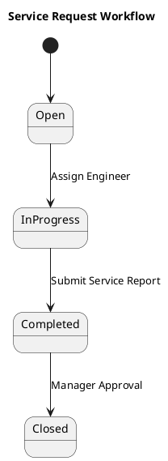

## ERD — Main Entities

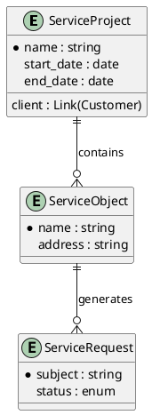

---

## Definition of Ready (DoR)
- Requirements documented.
- Acceptance criteria defined.
- Dependencies resolved.
- Test data prepared.

## Definition of Done (DoD)
- Feature implemented and tested.
- Documentation updated.
- Reviewed and approved.
- Deployed to staging/prod.

---

## Workflow — Service Request

## Workflow — Service Report

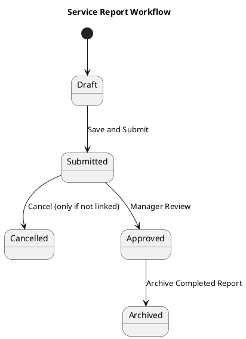

## Workflow — Invoice

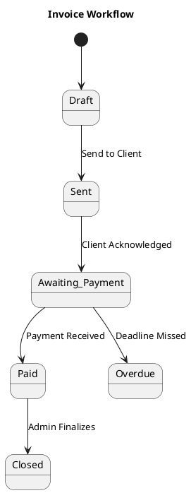

---

## ERD — ServiceProject

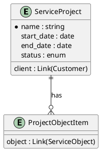

## ERD — ServiceObject

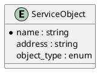

## ERD — ServiceRequest

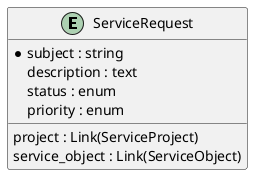

## ERD — ServiceReport

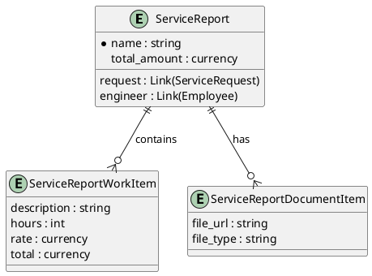

## ERD — Invoice

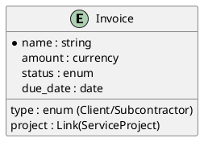

## ERD — PayrollEntryCustom

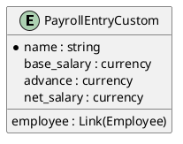

## ERD — CustomAttachment

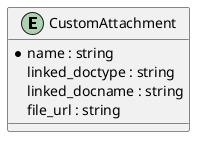
