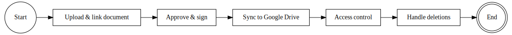

# Document & Attachment Management (Centralized File Handling)

### Figure 6: Document & Attachment Management BPMN

Throughout all the above processes, a lot of files and documents are generated – contracts, acts, invoices, photos, etc.
- This part of the system manages those files to ensure they are stored securely and accessible to those who need them, while keeping the ERP database lean.

### Uploading & Linking

- Users in all roles upload documents to the system at various stages: a contract PDF attached to a Service Project, photos attached to a Service Request, signed acts attached to a Service Report, invoices attached to Invoice records, and so on.
- In ERPNext, attachments can be handled using the built-in file manager, but to add more structure, Ferum Customizations defines custom DocTypes: originally PhotoAttachment and DocumentAttachment were considered, but the design is to unify these into a single CustomAttachment doctype for simplicity.
- A CustomAttachment record might store metadata about the file (filename, type, linked document type and ID, uploader, timestamp) and either the file content or a link to it.

- When a user attaches a file through a form (say, adds a PDF to a ServiceProject), the system creates a CustomAttachment entry and links it to that project.
- The file itself is immediately uploaded to the server (and subsequently will be synced to Google Drive).
- Each business document (Project, Request, Report, etc.) can thus have a list of related attachments in ERPNext, visible on the form for easy reference.

### Document Lifecycle – Approval & Signing

- Many documents go through approval workflows outside the system.
- For instance, a draft contract might be edited and then approved by the director before signing, or a work act might need signatures from the client.
- Ferum Customizations doesn’t fully automate content editing or digital signatures (unless integrated with an e-sign service), but it tracks the status by the presence of attachments and status fields.
- For example, a ServiceReport might have a field “Client Signed” or an attachment of the client-signed scan.
- The system relies on users uploading the final signed versions.

- Approval steps (like the director approving a contract) are typically done via a combination of communication (perhaps the director gets notified to review the contract PDF attached to the project) and setting a status field or checkmark once approved.

### Storage in Google Drive

- A key design decision is to store most files in Google Drive rather than on the local server.
- This gives virtually unlimited storage, easier sharing, and an off-site backup.
- All attachments added via ERPNext are automatically pushed to a specific Google Drive folder structure.
- The business decided that maintaining separate folders per project is not strictly necessary – instead, all files can reside in a central repository (with naming conventions to tie them to projects/requests).
- For example, a file might be named or tagged with the project code and request ID.
- Alternatively, the integration could create subfolders by project for better organization; the current plan leans toward a single store for simplicity, but this is configurable.
- Regardless, once a file is uploaded in ERPNext, the system (via the custom backend or a scheduled task) will upload it to Drive and possibly replace the file URL with a Drive link.

### File Deletion

- To avoid orphaned files or clutter, Ferum Customizations implements a cleanup hook.
- If a user deletes an attachment record from the system (say removing an incorrectly uploaded photo), the system will also remove the actual file from the storage (Drive) to keep things tidy.
- A server script on the CustomAttachment DocType’s on_trash event calls the Google Drive API to delete the file from the cloud, provided it’s not linked elsewhere.
- This prevents buildup of unneeded files and protects sensitive information from lingering in storage when it’s no longer tied to any record.

### Access Control

- Attachments inherit the permissions of the documents they are linked to.
- For instance, a client can only see attachments on their own projects/requests; an engineer can see photos on requests he’s assigned to, etc.
- This is managed implicitly by ERPNext’s permission system (since attachments are usually accessible via the parent document or via a file list filtered by permissions).
- If needed, additional restrictions can be added such as marking certain attachments as private (requiring login to view).

- With this Document Management process, the company achieves a centralized repository of all important files.
- No more scattered network drives or personal email attachments – everything is tied to the relevant record in the ERP, and stored in Google Drive which is secure and searchable.
- It also means during audits or management reviews, one can pull up, for example, a project and immediately retrieve all its related files (contracts, acts, photos) in one place.
