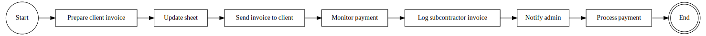

# Invoicing & Payments (Client Billing and Contractor Payments)

### Figure 4: Invoicing & Payments BPMN

This module automates financial document handling: issuing invoices to clients and processing incoming bills from subcontractors.
- It involves both ERPNext records and external integrations (Google Sheets for tracking, and notifications for finance oversight).

### Client Invoicing

- Towards the end of a service period (e.g., monthly for ongoing contracts, or upon work completion for one-off jobs), the Project Manager prepares the billing for the client.
- According to the business process, around the 20th–23rd of the month when work began, the PM will generate the necessary financial documents: the client’s invoice, a VAT invoice (if applicable), and two copies of the act of completed work (ServiceReport) for signing.
- Some of these documents come from Ferum Customizations (the invoice data), while others might be standard accounting forms.
- The PM might also need to ensure the client exists in the company’s accounting system (if they use an external system like 1C).
- If not already present, the PM or accountant registers the new client in that system (step outside of ERPNext).
- The PM then uses Ferum Customizations to create an Invoice record representing the client’s bill.
- The Invoice is implemented as a custom doctype or model in the custom app (since ERPNext’s core might not be used for this billing, it’s handled externally).
- Each invoice includes: the project it pertains to, the billing period or date, the amount due, the counterparty (which in this case is the Customer client), a description or basis for the charge (e.g.
- “Maintenance services for July 2025”), tax details (like whether VAT is included), and references to any attachment (like the signed act, etc.).

- When the PM creates the invoice, Ferum Customizations automatically updates a Google Sheet that acts as a financial register.
- This Google Sheet (“Invoices Tracker”) contains a row for each invoice, capturing key fields (project, month, amount, etc.).
- A backend integration (using Google Sheets API) either appends a new row or updates an existing one with the invoice data.
- The sheet has built-in formulas to sum totals by project and period, giving management a quick overview of revenue.
- The sheet is also used to monitor compliance: as per requirements, if someone other than the designated PM creates an invoice for a project, that row is highlighted automatically (except for specific internal projects).
- This is achieved by conditional formatting or a script in the Google Sheet that checks the “Created By” or a special flag provided by the system.
- It ensures that only authorized people handle invoices for each project (e.g., PMs for their projects, or HR for payroll projects like “Office salaries”).

- After generating the invoice and updating the sheet, the PM sends the invoice and accompanying documents to the client for approval.
- The system can assist here: it might generate a PDF of the invoice and the act, which the PM can email via the system or download and email manually.
- The client is expected to sign the act(s) and eventually pay the invoice.
- Between the 23rd–30th of the month, the PM will mail out physical originals of the closing documents (signed acts, etc.) to the client via registered post if required.
- The PM then actively monitors the payment status – this becomes part of accounts receivable (A/R) management.
- The Invoice record in the system has a status field (e.g.
- “Pending”, “Paid”), which the PM or Administrator updates when payment is received.
- The system logs all status changes for audit, so changing an invoice to “Paid” will record who did it and when.
- A key metric from this sub-process is outstanding receivables: the admin can pull a report of all unpaid invoices per project, helping track any client who is overdue.
- Ferum Customizations could send reminders or alerts if an invoice remains unpaid beyond a certain period.

### Subcontractor Payments

- In parallel, the system handles the company’s payables to subcontractors.
- When subcontractors complete work (often the same work that was documented in the ServiceReport), they will send their own invoice and supporting documents to the company.
- The Project Manager collects the subcontractor’s packet which typically includes: copies of work logs (with client’s signature, if they maintain a logbook on-site), a signed act of completed work between the contractor and the company, the subcontractor’s invoice for their services, and any applicable tax documents (like a VAT invoice or, for self-employed individuals, a receipt).
- The PM ensures they have all needed paperwork in physical form.

- The PM or Office Manager then logs this in Ferum Customizations by creating an Invoice record for the subcontractor’s bill.
- This is done in the same Invoice doctype but the “counterparty” is set to the subcontractor (who might be represented as a Supplier in the system or simply identified by name if not tracked as a master record).
- The invoice type might be marked as “Payable” vs “Receivable” internally.
- The PM enters the amount, the project, the period it covers (e.g.
- the same month of service), and attaches scanned copies of the subcontractor’s documents to this invoice record.

### When this invoice is saved, the same Google Sheets integration kicks in

- the system adds a row to the Invoices Sheet representing the subcontractor payment.
- This allows the sheet to also tally costs by project.
- It may mark these differently (perhaps a column indicating whether the row is client or subcontractor).
- The sheet’s formulas could subtract these to compute project profitability (revenue minus subcontractor cost).
- Additionally, if someone other than the assigned PM is logging a subcontractor invoice, that row is highlighted, as mentioned above (this encourages accountability in data entry).

- The system sends out a notification to the Administrator when a new subcontractor invoice is uploaded.
- This alert (via email and/or Telegram) tells finance that there is a payment pending approval.
- The admin (or Chief Accountant) will then process the payment externally (through bank, etc.).

- After verifying the subcontractor’s documents, the PM places the paper originals (signed acts etc.) into the company’s archive (filing cabinet).
- In the system, they update the status of the Invoice record to “Awaiting Payment” or “Approved for Payment”.
- Once the accounting department executes the payment to the subcontractor, the Chief Accountant or admin marks the Invoice as “Paid” in the system.
- All these status changes – New -> Awaiting Payment -> Paid – are logged with timestamp and user, creating an audit trail.
- This way, if any question arises (e.g., a subcontractor claims they haven’t been paid), one can see exactly when payment was marked and by whom.

### Integration & Automation

- The reliance on Google Sheets is a design choice to give non-technical staff a familiar interface for financial tracking and to leverage spreadsheet functions.
- The system uses the Google Sheets API to push data; thus an internet connection and API credentials are required.
- Data in the sheet is near real-time after any invoice entry.
- Google Drive is used to store scans of invoices and acts, ensuring they are backed up and accessible (links to these files could be stored in the Invoice record as well).
- Additionally, any file attachments in ERPNext (if not directly uploaded to Drive) are periodically synced.

### Security & Permissions

- Only authorized roles can create or edit Invoice records.
- Typically, Project Managers create them, but perhaps Office Managers have access to create as well (per the role definitions).
- The Administrator or Chief Accountant likely has rights to change statuses to “Paid”.
- The system enforces these permission rules so that, for example, a PM cannot mark their own invoice as paid – that requires accountant approval.

### By automating invoicing, the system provides transparency

- the management can open the Invoices Sheet or run an ERPNext report to see all invoices for a given month, with sums for each client and each subcontractor, giving a quick view of profitability.
- It also reduces delays – as soon as an invoice is created, stakeholders get notified, rather than waiting for a memo or email.
