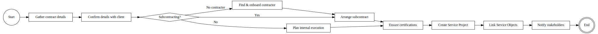

# Project & Contract Management (Initiating New Projects)

### Figure 1: Project & Contract Management BPMN

This process begins when a new service project/contract is won or approved, and it covers all steps to set up the project in the system and align all parties.
- The Project Manager (PM) receives information about a new contract (e.g.
- after winning a tender) and gathers the contract documentation and technical scope.
- The PM contacts the client to confirm details – sending a welcome email with contact information (copying the department head) and making an introductory call.
- If subcontractors will be involved, the PM determines the approach: in cases where subcontracting is allowed by the contract, the PM arranges a subcontract (mirroring the client contract terms) and gets it signed; if subcontracting is not permitted, the PM plans internal execution with the department head; if no suitable subcontractor is readily available, the PM will find and onboard a new contractor (signing an agreement).
- The PM also ensures any required certifications for subcontractor personnel (electrical safety, etc.) are obtained before work starts.

- Once preliminary coordination is done, the PM creates a new Service Project record in ERPNext to formally register the project/contract.
- Key details entered include the project name, contract period (start and end dates), the service location or site, the client (linked Customer record), assigned personnel (Project Manager, etc.), the contract value, and contract status (e.g.
- “Active”).
- The PM then links the specific Service Objects (equipment or sites under maintenance) to the project.
- Each Service Object (e.g.
- a building’s fire alarm system) is either selected from the existing registry or created if new.
- These objects are attached to the project via a child table (ProjectObjectItem), effectively listing all assets covered by the contract.

### System Automation

- The system enforces data integrity during project setup.
- A validation hook on ServiceProject ensures that the same Service Object is not added twice to a single project.
- Additionally, a cross-project uniqueness check prevents linking an object that is already associated with another active project – attempting to do so will raise an error indicating that object is “already linked to project X”.
- This guarantees one contract owns a given service object at a time, aligning with contract exclusivity.
- The system also validates date fields (the end date cannot be before the start date) and that the contract amount is non-negative.
- Furthermore, a hook on the Service Object DocType prevents deletion of any service object that has active (not Closed) service requests linked, preserving historical data.

### Communications & Notifications

- Upon creating a new project, the system can send out notifications.
- For example, a template “welcome” email to the client contact is triggered when a project is marked Active, introducing the project team and points of contact.
- This email can CC the sales or operations head as needed.
- Optionally, an integration with the Telegram bot notifies internal stakeholders (e.g.
- the General Director or a group chat) that a new project has commenced.
- These notifications keep everyone aligned at project kick-off.

### External Integration

- In some cases, new client or project data may need to be entered into external systems (such as a finance system like 1C or a CRM like “KUB-24” used by the company) for accounting or CRM purposes.
- While this step might be manual initially (the PM or office staff registering the client/contract in another system), Ferum Customizations is designed to ease data export/import if needed.
- For instance, client and project records can be exported in a format that 1C can import, to avoid double entry.

### User Interface

- Project records are managed through ERPNext’s standard form interface, customized for ServiceProject.
- The form includes fields for all contract info and a table for service objects.
- The PM uses this form to add objects and set details.
- A custom dashboard or summary view for projects is provided, showing linked Service Requests, total invoices issued, and other KPIs per project (e.g.
- number of open requests).
- In the custom React frontend, a Project Management module offers list and detail views for projects – allowing quick search/filter (by client or status) and viewing all related entities (objects, requests, reports, invoices) in one place.
- This gives project managers a one-stop view of contract performance.
