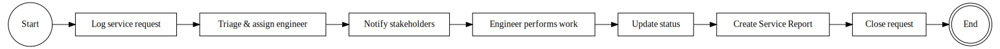

# Service Request Management (Ticketing for Maintenance Calls)

### Figure 2: Service Request Management BPMN

This is the core daily workflow where maintenance issues are reported and resolved.
- A Service Request can be initiated by the Client (e.g.
- via a customer portal or by messaging the bot), or internally by an Office Manager (if a client calls or emails) or Project Manager (for scheduled maintenance tasks).
- In all cases, the request is logged as a ServiceRequest document in ERPNext (or via the equivalent API endpoint).
- The request captures critical information: the site or equipment affected (Service Object and address), a description of the problem, the request type (e.g.
- Technical Maintenance vs Emergency Call), the urgency/priority, and links to the relevant Project and Customer.
- If the request is created via the ERPNext form, a client script assists the user by auto-filling fields – selecting a Service Object will automatically set the Project and Customer fields based on that object’s linkage.
- This ensures consistency (the request is tied to the correct contract and client) and speeds up entry.
- Certain fields are mandatory to submit a request (e.g.
- problem description, object or address, etc.), enforcing that no critical info is missing.

- Once submitted, the Service Request enters the triage/assignment stage.
- Typically, the Department Head or PM reviews new requests (especially if they come from a client directly).
- They determine assignment: an available Service Engineer (or a subcontractor’s technician) is assigned to handle the issue.
- The system records the assigned engineer on the request form.
- Immediately upon creation and assignment, the system triggers notifications to relevant parties.
- If the request is marked as “Emergency”, an urgent alert is sent out – for example, a Telegram message to all on-call engineers and a notice to the admin/project manager group.
- For normal requests, notifications are still sent: typically an email to the assigned engineer (with details of the issue and location) and a notification to the client (acknowledging that their request was received and is being processed).
- These can be done via ERPNext’s notification system or via the integrated bot (e.g.
- the engineer gets a Telegram message with the request info).

- Once an engineer is assigned and notified, they execute the work.
- The engineer (or subcontractor) visits the site and performs the required maintenance or repair.
- During this time, they might update the request status to “In Progress” via the mobile app or bot command, indicating work has started.
- The system’s workflow rules enforce logical status progression: e.g.
- a request should move from Open → In Progress → Completed → Closed in order.
- It’s not allowed to jump straight to Completed or Closed without intermediate steps, and unauthorized status changes are blocked.
- Only certain roles can mark a request as Closed (perhaps a PM or Administrator after verifying completion).
- If an engineer tries to mark a job complete, the system will require that a Service Report (work completion report) is linked first.
- This is a key rule: a request cannot be closed without documentation of the work done.
- The ServiceRequest DocType includes a field for the linked report, and a validation hook checks that if status is being set to “Completed” or “Closed”, the linked_report field must be filled (i.e.
- a ServiceReport exists).
- If not, an error is raised prompting the user to create the Service Report before closing.

- Throughout the request lifecycle, photo and document attachments can be added.
- Engineers often take photos of the equipment or site (before and after service).
- These are attached either through the ERPNext form or via the bot (the Telegram bot allows an engineer to send a photo with a command to attach it to a request).
- Under the hood, each photo or file is saved as a CustomAttachment record and linked to the ServiceRequest via a child table (RequestPhotoAttachmentItem).
- This provides a visual log for the client and management to see what was found and fixed.
- The system ensures these attachments are stored properly (ultimately in Google Drive for long-term storage) and that they are easily accessible from the request record.

- When the engineer finishes the work, they update the request status to Completed (signifying work done on-site).
- The completion timestamp is captured – if the user forgot to set it, the system can automatically set the actual end time to now when marking Completed.
- The request may remain in a “Completed” state until paperwork is done and the client confirms, after which an admin/PM can mark it Closed.
- If the issue is not actually resolved or needs re-work, the request could be re-opened (which the system allows only with proper role permission).

### SLA and Monitoring

- The system can track the time a request remains open.
- A script computes the duration from creation to completion whenever those timestamps are available.
- This can populate a field like “resolution_time_hours” for use in KPI reports.
- Additionally, if a request is nearing or exceeding an SLA threshold (say, an emergency not responded to within 2 hours), the system could send escalation alerts (e.g.
- email to management).
- These overdue checks might be implemented via scheduled jobs that scan for open requests past due and notify the responsible persons.

### Client Involvement

- Clients using the system (with the “Client” role) can log in to a web portal or use the Telegram/WhatsApp bot to submit new requests and check statuses.
- The bot interface is a key convenience: for instance, a client can issue a command /new_request with a description, and the backend will authenticate them and create a ServiceRequest on their behalf.
- They will receive updates through the bot as the status changes (e.g.
- “Engineer has been assigned and is on the way”).
- This reduces the need for phone calls and keeps customers in the loop.

- Finally, once linked work reports are completed (next process) and the request is fully resolved, it is closed.
- The result of this process is a logged maintenance ticket with a full history of what was done, by whom, with supporting photos and documents, and notifications/alerts that ensured a timely response.
