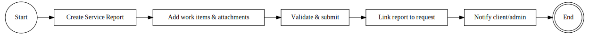

# Work Reporting (Service Reports for Completed Work)

### Figure 3: Work Reporting BPMN

After a service request’s work is finished on-site, the work must be documented and approved.
- This process results in a Service Report (also known as an “Act of Completed Work”) which is essentially a detailed report of the services performed.
- The process is triggered when a Service Request is marked as completed (work done) – at this point, the assigned Engineer or the Project Manager will create a ServiceReport in the system to capture the results.

- On the ERPNext side, ServiceReport is a custom DocType designed for this purpose.
- When creating the report, the user links it to the corresponding Service Request (there’s a field for the request ID, and the form can even be launched directly from the request for convenience).
- The report includes fields like the date of completion, a summary, and crucially a breakdown of the work performed.
- The breakdown is captured in a child table ServiceReportWorkItem, where each line item represents a task or item serviced – including a description of work, quantity, unit of measure, and cost or value for that item.
- For example, one work item might be “Replaced 5 smoke detectors” with the cost of parts and labor listed.
- Multiple work items can be entered to comprehensively describe the job.

- As part of creating the report, the engineer/PM also attaches any relevant documents or evidence.
- There is a second child table ServiceReportDocumentItem for attachments.
- This is where they might attach a scanned copy of a physically signed work report (if the client signs a paper copy), any test results, or additional photos that specifically pertain to the completed work.
- Essentially, it serves as an archive of all documentation proving the work was done and accepted.

### Automations

- The ServiceReport form has server-side scripts to assist and enforce data integrity.
- A before_save hook calculates the total amount of the report by summing up all the Work Item costs.
- This ensures the report’s total (which might be used for billing or just for reference) is always consistent with the line items, eliminating manual calculation errors.
- A validation script also ensures no required details are missing – for instance, it can verify that each ServiceReportWorkItem has a description and that at least one work item exists.
- If something is amiss, it throws an error prompting the user to fill in the missing info before submission.

- When the report is complete, the engineer/PM submits the ServiceReport document (in ERPNext, this changes its status to a submitted state, indicating it’s finalized).
- The submission triggers a chain of updates: a custom on_submit hook links this report back to the Service Request and updates that request’s status.
- Specifically, the ServiceRequest’s linked_report field is set to the new report’s ID, and the request status is automatically transitioned to “Completed” (or “Closed” if no further steps are needed).
- This automation ensures the ticket is closed out properly once the report is in place.
- (In practice, some implementations might mark it “Completed” at report submission and require a manager to mark it “Closed” after client sign-off – the system can support that nuance by distinguishing the two states.)

- After submission, the ServiceReport becomes an official record.
- The system now enables a printable PDF of the report, using a standard print format or a custom template so that it looks like a formal act of work completion.
- This can be emailed directly to the client from the system if needed.
- In Ferum Customizations, there’s the ability to click “Email” on the report form, which will generate the PDF and send it to the client’s email on file – this saves time in getting the client a copy of the work report for their records.

### Document Management

- All related materials are stored for future reference.
- If the client signs a hard copy of the Service Report or an associated acceptance certificate, the PM will scan those and attach to the ServiceReport (even if the report is submitted, the system allows adding to the DocumentItem table, possibly via an amendment or a version of the report).
- The system facilitates archiving these attachments to Google Drive.
- When a ServiceReport with attachments is submitted, a background process (or scheduled job) can automatically upload those files to a designated Drive folder.
- For example, there might be a main “Service Reports” Drive folder or one per project where all such documentation is stored.
- The integration uses the Google Drive API to push files and could record the Drive link in the CustomAttachment or ServiceReportDocumentItem entry for reference.
- This way, the company has a cloud backup of all reports and evidence outside the ERP, and can easily share or retrieve them.

### Approval & Follow-up

- In this workflow, often the General Director or Dept Head might need to approve the completed work (especially for larger projects or initial inspection reports).
- In the business process, there’s mention of an “Act of initial inspection” and a defect report that the PM creates within 15-20 days of starting work, which is then approved by the department head and sent to the client.
- These are preliminary documents ensuring both parties agree on the starting condition and what needs fixing.
- While these might be handled as separate documents (perhaps outside the system or as attachments in a project), the technical design could incorporate them either as a special type of ServiceReport or just as file attachments that are tracked.
- Regardless, once the final ServiceReport (act of completed work) is signed off by the client, the PM moves those signed originals to the company archive (both physical and digital).
- In the system, the PM will mark the ServiceRequest fully Closed if not already, indicating everything for that request (work and paperwork) is done.
- The ServiceReport process thus provides the necessary traceability and accountability – every maintenance job has a corresponding report with what was done and proof of completion.

- Finally, completing the ServiceReport may trigger a notification to accounting or admin that the job is done, which might kick off the invoicing process (next workflow) for client billing.
- The admin or PM can use the info in the ServiceReport to prepare an invoice if it’s a billable service.
- In summary, the Work Reporting process ensures no work goes undocumented and ties up the Service Request loop with proper approvals and records.
