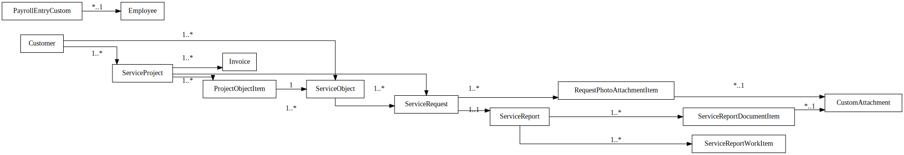

# Entity-Relationship Model

The core data model revolves around a set of custom DocTypes (data entities) in ERPNext that capture the domain concepts, along with relationships between them. The following diagram shows the main entities and their relationships:

Each box represents a DocType (or key model), with primary fields, and lines indicate relationships (arrows point from parent to child or one-to-many link). Below is a description of each entity:

### Customer

- Standard ERPNext doctype representing a client (organization or individual) who receives services.
- Each Customer can have multiple Service Projects and Service Requests associated with it.
- Customers also have related Service Objects (assets at the customer’s site).
- In the ERD, Customer is linked one-to-many with ServiceProject and ServiceObject.

### ServiceProject

- A custom DocType for maintenance contracts/projects.
- It represents an ongoing service agreement with a customer.
- Fields include project name, start/end dates, status (e.g.
- Active, Completed), contract amount, and a link to the Customer.
- A ServiceProject may cover multiple ServiceObjects – those are listed via a child table ProjectObjectItem.
- In the ERD, ServiceProject is one-to-many with ProjectObjectItem, and also one-to-many with ServiceRequest (since many requests can happen under one project).

### ServiceObject

- A custom DocType representing a specific asset or location that requires service.
- For example, a building’s fire alarm panel, sprinkler system, etc.
- Fields include object name, location/address, type of equipment, and a link to the Customer (who owns it).
- In implementation, ServiceObject also may have a field linking to the current ServiceProject (if under contract) – ensuring an object is tied to at most one active project at a time.
- ServiceObject is connected to ServiceRequest (one object can have many requests over time) and to ProjectObjectItem (if listed under a project).

### ProjectObjectItem

- A child table DocType used within ServiceProject to enumerate the Service Objects included.
- Each ProjectObjectItem links one ServiceObject to the parent ServiceProject.
- This effectively creates a many-to-many relationship between ServiceProject and ServiceObject (over time an object might appear in different projects, but not concurrently due to validation).
- In the ERD, ProjectObjectItem has foreign keys to ServiceProject (its parent) and ServiceObject.

### ServiceRequest

- The DocType for service tickets or maintenance requests.
- Fields include a title/description of the issue, type (routine or emergency), links to Customer, ServiceProject, and/or ServiceObject (so the request is tied to a specific contract and asset), priority level, status, assignment (engineer), and timestamps (reported time, start time, completion time).
- ServiceRequest has a one-to-many relationship with attachments (photos/docs) and a one-to-one (or one-to-many, but practically one) relationship with ServiceReport (each request will produce at most one ServiceReport).
- In the ERD, ServiceRequest is linked to RequestPhotoAttachmentItem (child table of attachments) and to ServiceReport.

### RequestPhotoAttachmentItem

- A child table DocType for storing multiple attachments (photos or documents) related to a ServiceRequest.
- Each item typically references a file (via CustomAttachment).
- In the diagram, it’s shown linking ServiceRequest to CustomAttachment (many attachments per request).

### CustomAttachment

- A unified doctype for any file stored (could cover what was “PhotoAttachment” and “DocumentAttachment”).
- Fields include an ID, file URL or Drive ID, file type, and metadata.
- CustomAttachment records are linked to parent documents via the child tables (like RequestPhotoAttachmentItem or ServiceReportDocumentItem).
- In the ERD, CustomAttachment is the central file reference, with lines from it to those child tables (meaning one attachment can potentially be referenced in multiple contexts if needed).

### ServiceReport

- The DocType for work completion reports/acts.
- Fields include a link to the related ServiceRequest, date of report, status (Draft/Submitted), and a total amount.
- ServiceReport has two child tables: ServiceReportWorkItem and ServiceReportDocumentItem.
- It is typically one per ServiceRequest (1:1 relationship in logic, enforced by linking fields and validation).
- In the ERD, ServiceReport links back to ServiceRequest (one report per request).

### ServiceReportWorkItem

- A child table under ServiceReport to list detailed tasks or items in the report.
- Fields include description of work, quantity, unit, and cost.
- Many work items belong to one ServiceReport.

### ServiceReportDocumentItem

- Another child table under ServiceReport for attachments.
- Each entry links to a CustomAttachment (file) that is attached to the report (e.g.
- a scan of signed document).
- Many documents can be attached to one ServiceReport.

### Invoice

- A custom model (could be a DocType in ERPNext or an external entity) representing an invoice for either client billing or subcontractor payment.
- Fields include an ID, linked Project (if applicable), the month/period or date, amount, currency, counterparty (Customer or subcontractor), status (e.g.
- New, Sent, Paid), and references to attachments (like PDF of the invoice or acts).
- In the ERD, Invoice is linked many-to-one with ServiceProject (a project can have multiple invoices over time).
- It also implicitly links to Customer or subcontractor, though in the model that may just be a text field or a link to Customer/Supplier.

### PayrollEntryCustom

- A custom DocType extending ERPNext’s Payroll Entry for salary calculations.
- Fields include an ID, payroll period, and total payable amounts, plus possibly a table of individual pays or a link to employees.
- In the diagram, we include Employee (standard ERPNext doctype for employees).
- PayrollEntryCustom likely has a child table of salary slips or references employees, but for simplicity we show a link to Employee (meaning the payroll entry can be associated with employees in some fashion).
- The main point is that employees (and their work time data) feed into PayrollEntryCustom which then produces salary records.
- The relationship can be one PayrollEntry covering many Employees (one-to-many).

### Employee

- Standard doctype for company staff.
- Each Employee can have entries in PayrollEntryCustom.
- (Also employees can be linked as the “assigned engineer” in ServiceRequest – though in ERPNext that assignment might use the User or Employee record.)

### User

- (Not depicted in the ERD to avoid clutter) – ERPNext user accounts, each mapped to one or more roles (Admin, Project Manager, etc.).
- Users are linked to Employee records for internal staff.
- Permissions are handled at user/role level rather than as relational links in data.

- This ERD and description cover the primary data structure of the system.
- It is designed to maintain referential integrity (e.g., cannot delete a Service Object if linked to active requests) and to efficiently fetch related information (for instance, from a ServiceRequest you can navigate to its Project, Customer, Object, attachments, and work report).
